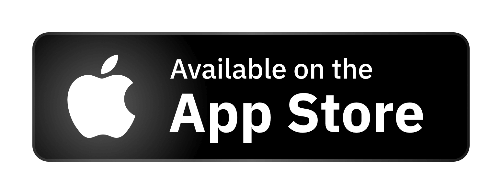

 

  

  <h1 align="center">Rune</h1>

  

    The player that blends classic design with modern technology.
  

  

    
    
    
    
    
    
    

  

https://github.com/user-attachments/assets/f363ff5e-d8e5-49b1-81f1-74efa831f83a

## Introduction

Rune Player is a music player that offers audio analysis and recommendation features. It introduces a new, modern music management paradigm to enhance your experience with cross-platform support.

  

    
    
    
    
    
    
  

## Motivation

Rune is a UX experiment inspired by the question: What if Zune[^1] had continued to evolve? Using a modern tech stack, Rune captures the essence of Zune, drawing from the design highlights of various Windows products since the Windows XP era, including Windows Mobile[^1] and Windows Media Center[^1].

The motivation behind Rune is to provide a modernized audio listening and management experience. With the rise of streaming services, localized music players have become less common, and many well-known media players have stagnated. Rune aims to offer a clean, consistent, and efficient audio playback experience.

## Unique Features

- **Distinctive Design**: Rune boasts a unique design style that respects user intent with no intrusive ads or unnecessary UI elements.
- **Highly Customizable**: A complex responsive system ensures optimal viewing on various screen sizes, with comprehensive keyboard support and customizable color themes.
- **Audio Analysis and Recommendations**: Users can analyze their entire music library to receive recommendations based on tracks, albums, or playlists.
- **Dynamic "Mix"**: Users can create dynamic playlists based on customizable rules, such as:

  - "Similar to this album"
  - "Top 100 most played tracks"
  - "Tracks similar to my favorites"
  - "Playlists including specific artists"

  These mixes automatically update as users listen to and add new tracks.

  
  
  

## Support Model

As MPL-licensed open-source software, Rune is free as in speech - you can freely modify and distribute it. However, **unlike free beer**, full community access requires a paid license. The base price starts at $10 globally, though actual costs may vary due to platform policies and regional adjustments.

To ensure sustainable development and continued innovation, we've established a tiered support system:

- **Paid Members:** Paid supporters can submit feature requests and receive priority support
- **Community Members:** Users of official binary packages can submit bug reports
- **Self-build Users:** Those who compile Rune themselves can access community support channels

For complete details about our support tiers and philosophy, please see our [support policy document](SUPPORT.md).

## Installation and Running

We encourage you to purchase and use Rune through the official channels available in the software stores mentioned above, as these are maintained by the Rune team.

However, for users with specific needs, you can choose to build your own binary package, download the [CI-provided binary builds](https://github.com/Losses/rune/actions) or use community-maintained packages like Scoop, Homebrew, and Flatpak. Please note that while some of these packages are acknowledged and supported by Rune developers, they are not officially maintained by Rune. We do not guarantee their stability or security.

If you want to compile your own binary package. The [documentation](https://github.com/Losses/rune/blob/master/documents/compiling.md) and [CI scripts](https://github.com/Losses/rune/blob/master/.github/workflows/build.yml) serve as excellent references.

Additionally, when using these unofficial sources, **you still need to purchase a license to become a genuine user**.

## Release Policy

Rune is divided into two release queues: the Production Queue and the Cutting Edge Queue. These queues release independently.

- **Production Queue**: Maintained by the Rune development team, ensuring no critical issues affect user experience before being pushed to stores. We only address software defects here, and no new features are introduced. Fixes go through Dev, Alpha, Beta, and RC stages before release.
- **Cutting Edge Queue**: Offers experimental features and is maintained by the community. Software packages from this queue may be available in community repositories, but Rune will never officially push these to users.

If a version in the Cutting Edge Queue reaches production quality after the RC stage, it will replace the version in the Production Queue and be pushed to users.

## Contributing

We're thrilled you're interested in contributing. Before you dive in, please take a moment to review these key points to ensure smooth collaboration. For detailed instructions, please refer to the full [Contributing Guide](CODE_OF_CONDUCT.md).

- **Language Requirement**: To facilitate clear communication across all developers, all contributions, including issues and pull requests, must be submitted in English. If you are not confident in your English proficiency, consider using a language model for assistance.
- **Feature Requests**: We do not accept feature requests from unpaid users.
- **Feature Implementation**: If you have a feature proposal, please reach out to the development team for a preliminary discussion to ensure it aligns with Rune's vision.
- **Documentation**: Collaboration is conducted exclusively in English. While we do not accept pull requests for translating the README or other development documentation, contributions for translating Rune itself are welcome.

## Acknowledgments

We extend our gratitude to the open-source project [Meyda](https://github.com/meyda/meyda) for enabling the audio analysis functionality. We also thank the countless developers in the Rust and Flutter ecosystems for making Rune possible.

## License

This project is licensed under the MPL License.

[^1]: All mentioned Microsoft products are trademarks of Microsoft. This project is not affiliated with Microsoft, and the founders of this project are not Microsoft employees.
