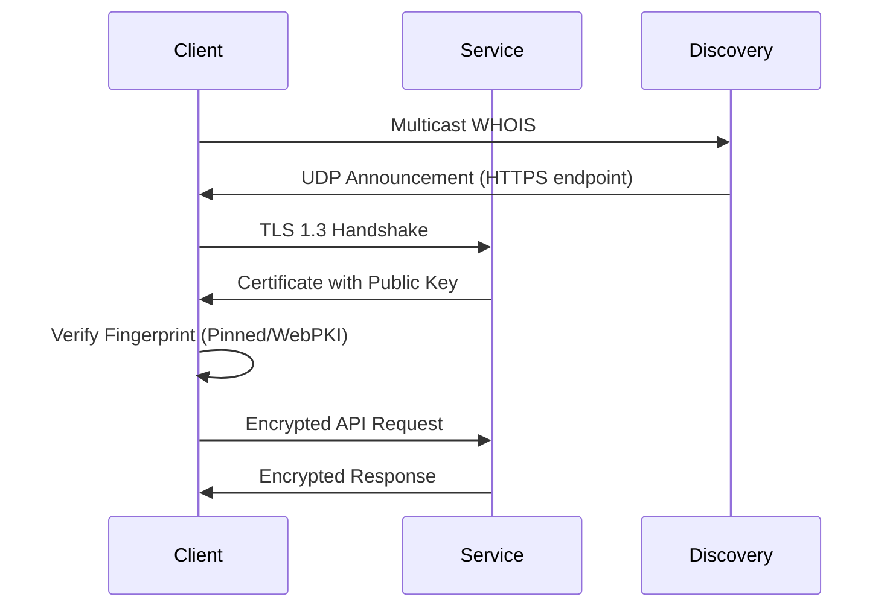

# Discovery: Secure Device Communication for Local Networks

## What is Discovery?

`discovery` is a secure peer-to-peer communication framework that enables Rune clients to safely discover and communicate with each other within a local network. Think of it as a way for devices to:

1. Find each other automatically on your network
2. Verify they're talking to the right device (not an impostor)
3. Communicate securely once connected

## Why Use Discovery?

Setting up secure device-to-device communication traditionally involves manual configuration and security risks. Discovery solves these problems by:

- **Zero Configuration**: Devices find each other automatically using multicast
- **Security First**: Built-in protection against man-in-the-middle attacks
- **Visual Verification**: Users can verify device authenticity through an innovative Rune character fingerprint system

## Key Features

### Automatic Device Discovery
Devices announce themselves on the network using IPv4 multicast (224.0.0.167:57863). Each announcement includes:
- Device identification (alias, model, type)
- Connection details (API port, protocol)
- Security fingerprint (40-character Rune encoding)

### Certificate-Based Security
- **Fingerprint Pinning**: Stores trusted device fingerprints locally
- **Visual Verification**: Displays 40 Rune characters for human verification
- **WebPKI Fallback**: Falls back to system root certificates when appropriate

## Implementing Device Pairing

When implementing device pairing, you must include fingerprint verification:

1. Display the 40-character Rune fingerprint on both devices
2. Implement an interactive verification challenge:
   - Remove 2 characters from the sequence
   - Present 3 choices to the user
   - Require correct selection to proceed

## Technical Details

### Communication Flow


### TLS Configuration
The framework uses TLS 1.3 with custom certificate verification:
```rust
ClientConfig::builder()
    .dangerous()
    .with_custom_certificate_verifier(Arc::new(cert_validator))
    .with_no_client_auth()
```
