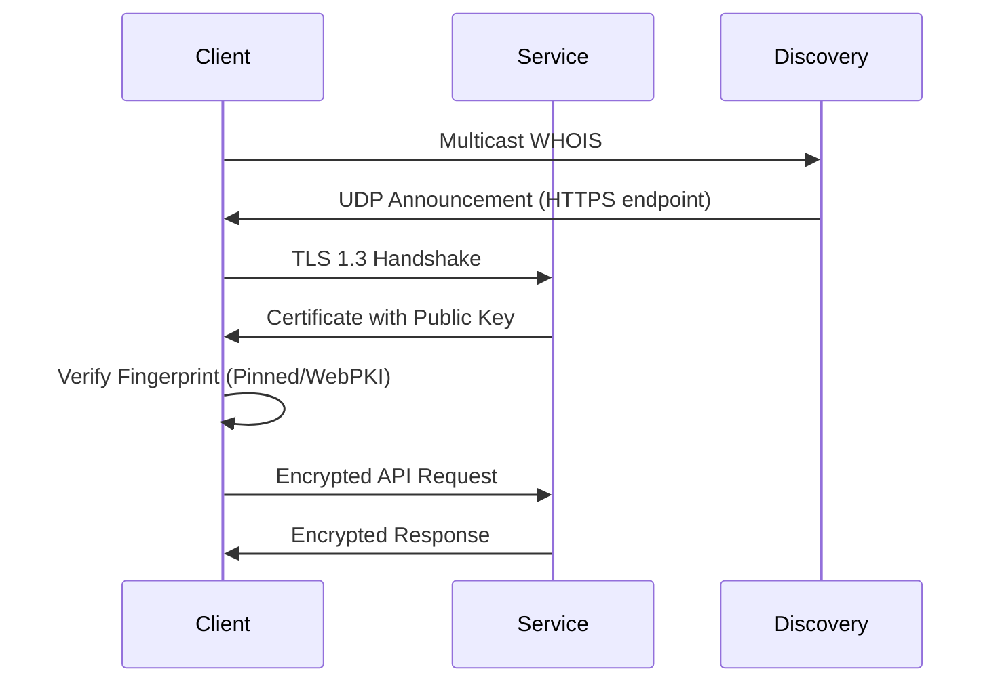

# Discovery: Secure Device Communication Framework for Local Networks

`discovery-rs` is a Rust crate designed to facilitate secure peer-to-peer communication within local networks. It provides a robust framework for devices to automatically discover each other, establish secure connections, and manage permissions in a zero-configuration environment.

## Purpose

This crate addresses the challenges of setting up secure and manageable device-to-device communication on local networks by offering:

- **Automatic Device Discovery:** Devices can seamlessly find each other on the network without manual IP address configuration.
- **Mutual Authentication and Security:** Ensures devices are communicating with legitimate peers and protects against man-in-the-middle attacks.
- **Permission Management:** Allows for controlled access and authorization between devices.

## Key Features

- **Multicast-based Device Discovery:**
  - Utilizes IPv4 multicast (address `224.0.0.167:57863`) for efficient device announcements and discovery within a local network segment.
  - Devices broadcast UDP announcements containing device identification (alias, model, type), connection details (API port, protocol), and a security fingerprint.
- **Certificate-Based Security with Fingerprint Pinning:**
  - Employs TLS 1.3 for secure communication channels.
  - Implements a custom certificate verifier (`CertValidator`) that combines:
    - **Fingerprint Pinning:** Allows storing and verifying trusted device certificate fingerprints for enhanced security and resistance to CA compromise.
    - **Visual Fingerprint Verification (Rune Encoding):** Presents a 40-character Rune encoding of the certificate fingerprint for out-of-band human verification, crucial for initial trust establishment.
    - **WebPKI Fallback:** Optionally falls back to standard WebPKI (system root certificates) verification when appropriate, offering flexibility in trust models.
- **Persistent Storage for Trust and Permissions:**
  - Leverages `PersistentDataManager` for robust and persistent storage of:
    - Trusted certificate fingerprints and associated hostnames (`CertValidator`).
    - User permissions and access control lists (`PermissionManager`).
  - Uses TOML files for human-readable configuration and data storage.
  - Implements filesystem watching to detect and react to external changes in persistent data.
- **Permission Management System:**
  - Provides `PermissionManager` for managing user/device permissions.
  - Supports user statuses (`Pending`, `Approved`, `Blocked`).
  - Allows operations like adding, removing, verifying, and changing user statuses based on fingerprints or public keys.
  - Implements IP-based application tracking (with a queue) for potential rate limiting or security monitoring.
- **Error Handling and Logging:**
  - Comprehensive error types (`PersistenceError`, `CertValidatorError`, `PermissionError`) for clear error reporting.
  - Utilizes the `log` crate for structured logging, facilitating debugging and monitoring.

## Technical Details

### Communication Flow



### Fingerprint Verification

For robust device pairing, implement visual fingerprint verification:
    1. Display Rune Fingerprint: Present the 40-character Rune encoded fingerprint on both devices involved in pairing.
    2. Interactive Challenge: Implement a challenge-response mechanism, for example:
        * Remove a few characters from the displayed Rune sequence.
        * Present multiple-choice options including the correct sequence and similar variations.
        * Require the user to correctly identify the original sequence to confirm visual verification and proceed with pairing.

### TLS Configuration

The framework uses TLS 1.3 with custom certificate verification:

```rust
ClientConfig::builder()
    .dangerous()
    .with_custom_certificate_verifier(Arc::new(cert_validator))
    .with_no_client_auth()
```
